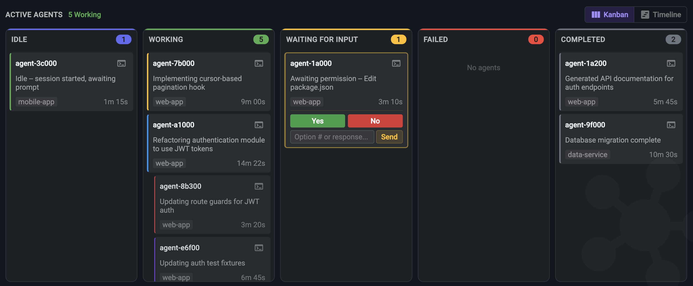
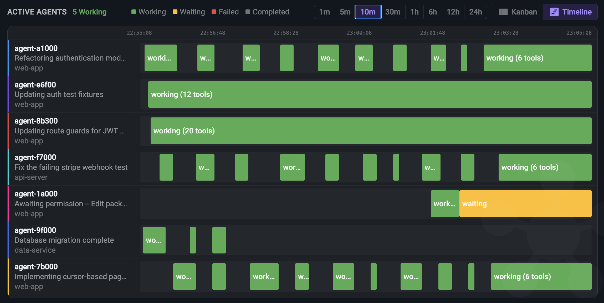
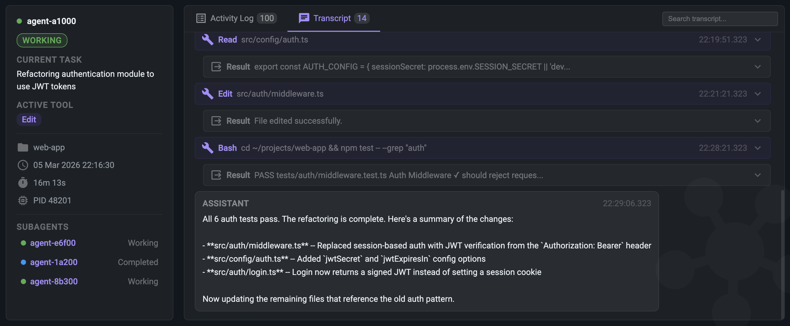
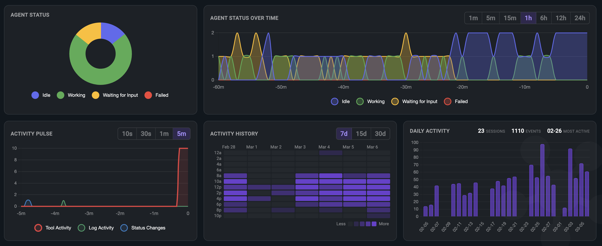

# Minion Orchestra

**[minionorchestra.com](https://minionorchestra.com)**

Real-time monitoring dashboard for AI coding agents. Track what your agents are doing, what tools they're calling, and why they made decisions -- all from a single dashboard.

## Real-time Agent Monitoring

Kanban board with status columns (idle, working, waiting, failed, completed). Subagent tracking with parent-child hierarchy and inline display. HITL permission panel with Yes/No buttons and freeform input to approve, deny, or respond to agent permission requests directly from the dashboard. macOS native notifications for permission requests, failures, and completions.



## Agent Timeline

Per-agent swim lanes showing activity over configurable time ranges (1m to 24h). The timeline moves in real time -- watch agents work, wait, and complete as it happens. Status-colored segments show working, waiting, and failed periods. Subagent segments display inline under their parent.



## Agent Detail & Transcript

Deep dive into any agent session with activity log, event stream, and full conversation transcript. Collapsible tool call blocks with input/output, search filtering, and auto-scroll.



## Insights & History

Activity heatmap (7d/15d/30d), daily activity chart, real-time activity pulse, agent status over time, and status distribution. All charts seed from historical data and stream live updates. Searchable session archive with filtering and export (JSON/CSV).



## Supported Agent Features

| Agent              | Hook Events | Subagent Tracking | Token Tracking | Transcripts | Scope    | Setup                                        |
| ------------------ | ----------- | ----------------- | -------------- | ----------- | -------- | -------------------------------------------- |
| Claude Code        | 22          | Yes               | Yes            | Full        | Global   | Automatic on install                         |
| GitHub Copilot CLI | 6           | No                | No             | Partial     | Per-repo | [Manual per repo](docs/setup-copilot-cli.md) |

See detailed setup instructions: [Claude Code](docs/setup-claude-code.md) | [GitHub Copilot CLI](docs/setup-copilot-cli.md)

### GitHub Copilot CLI limitations

GitHub Copilot CLI's hook and event system is still maturing. These limitations reflect what is currently exposed to external tools and may improve as GitHub expands the platform.

- **No token tracking** — Copilot CLI does not expose token usage data in its hook events or local session files.
- **No subagent tracking** — Hook events do not include subagent lifecycle data, so parent-child relationships between sessions cannot be tracked.
- **Partial transcripts** — Messages and tool calls are captured, but model reasoning is encrypted in the local session data and not accessible to external tools.
- **Per-repo setup** — Hooks must be configured in each repository rather than globally.

## Claude Code Quick Start

```bash
npm install
npm start
```

Open http://localhost:3000. Hooks are configured automatically during install -- start any Claude Code session and agents appear in the dashboard.

## GitHub Copilot CLI Quick Start

```bash
npm install
npm start
```

Then from the root of each repo you want to monitor:

```bash
bash {path-to-minion-orchestra-app}/setup-copilot.sh
```

---

Built by [Neutron Zero](https://neutronzero.com) | [Website](https://minionorchestra.com) | [Report an Issue](https://github.com/Neutron-Zero/Minion-Orchestra/issues)
